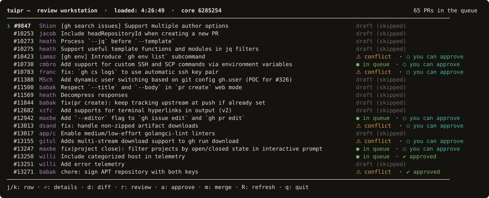

# tuipr

**A terminal review workstation for agent-generated pull requests.**

Coding agents open pull requests faster than anyone can read them. The
bottleneck stopped being how fast code gets written, or even how review
mechanics work — it is human attention, and the discipline to decide what a
review is worth spending. tuipr puts a human gate in front of the merge, in the
terminal, where the rest of the work already happens.



*Real output, not a mockup — the open pull requests of `cli/cli`, classified.*

## Status

**Early. Runs, not yet releasable.** The tool grew inside a private codebase and
is being generalized in the open. What works today:

- the PR queue, with computed status, against any GitHub repository
- navigation and the detail panel
- the diff, approve and merge paths, inherited from the original tool

Two features are **not** wired up, because they call a measurement script that
has not been generalized yet: conflict measurement (`c`) and AI conflict
resolution (`v`). They fail loudly rather than quietly — the missing script is
reported as such — and nothing else depends on them.

See [ROADMAP.md](ROADMAP.md) for the sequence and the reasoning behind it.

## What it does

- **Queue.** Every open PR with its computed status — landable, conflicted,
  blocked, draft. Status is computed in one place and only displayed elsewhere,
  so the list cannot disagree with the detail panel.
- **Review.** Hand the terminal to a hunk-level diff viewer, comment inline, and
  upload the findings as one review rather than a scatter of comments.
- **Budgeted AI review.** Run a coding agent over the selected PR in the
  background under an explicit spend cap. Findings arrive as notes inside the
  diff. Starting a second run takes a deliberate keystroke — accidental double
  spend should be hard, not merely regrettable.
- **Gates and attestation.** Merges pass independent gates, and approvals write
  an attestation into the GitHub audit trail, so the intent behind a merge
  outlives someone's shell history.


The panel separates what was **measured** from what was merely queried. It
states the landing blockers it knows, and says outright that the conflict axis
is *not measured* rather than leaving the silence to be read as "fine".

## Design principles

**Fail closed.** A silent success is a bug class, not a convenience. An empty
result and a failed query must never look the same to the caller.

**Spend is a decision, never a side effect.** The interface states plainly
whether tokens were spent — in both directions, including when they were not.

**Measured and inferred knowledge stay apart.** A missing measurement is
reported as missing, never as a zero. The consumer cannot tell a measured
negative from an absent one, so the producer must not blur them.

## Requirements

- Node 20 or newer
- [`gh`](https://cli.github.com), authenticated (`gh auth login`)
- `git`

Diff review needs [`hunk`](https://github.com/modem-dev/hunk), installed
separately:

```
brew install hunk
```

It is **not** bundled, and that is a measured decision rather than an
oversight. Depending on it directly pulls in its own runtime and per-platform
binaries: the install went from 23 MB to 367 MB. A single command to install a
single binary is the better trade, and tuipr finds `hunk` on `PATH`. Everything
except diff review works without it.

The same applies to `node-pty`, which is optional. Installing it (62 MB) buys
one thing: returning from the diff viewer without a brief flicker. Without it,
the terminal handoff uses `script(1)` instead.

## Architecture

The queue model is a **contract**, not an implementation. Classification,
landability and approvability are computed by a provider; every layer above
displays them and never recomputes them.

The default provider uses nothing but `gh` and `git`, so it runs against any
repository. `TUIPR_QUEUE_CMD` substitutes any command that emits the same JSON,
which is how a richer, measurement-based model — conflict sources, transitive
stacking — can return without the interface changing.

```
provider (gh + git)  →  queue model  →  rows / panel / actions
        ▲                                        │
        └──────── TUIPR_QUEUE_CMD ───────────────┘
                  (any other producer)
```

## License

MIT
